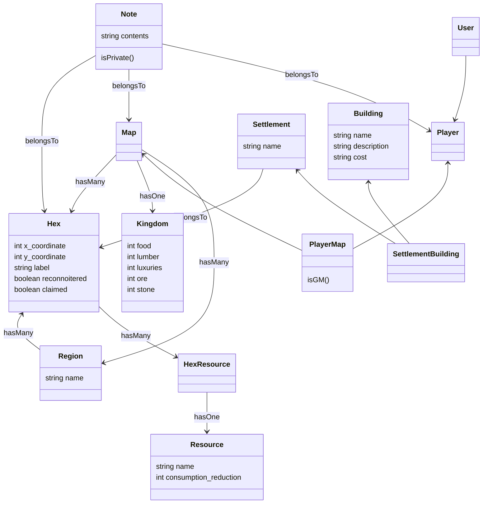

Map
A map has many hexes
Hexes have
  * coordinates

resources

| id | name        | ore_generation | food_generation | lumber_generation |
|----|-------------|----------------|-----------------|-------------------|
| 1  | mine        | 1              | 0               |                   |
| 2  | farm        | 0              | 1               |                   |
| 3  | lumber mill | 0              | 0               | 1                 |